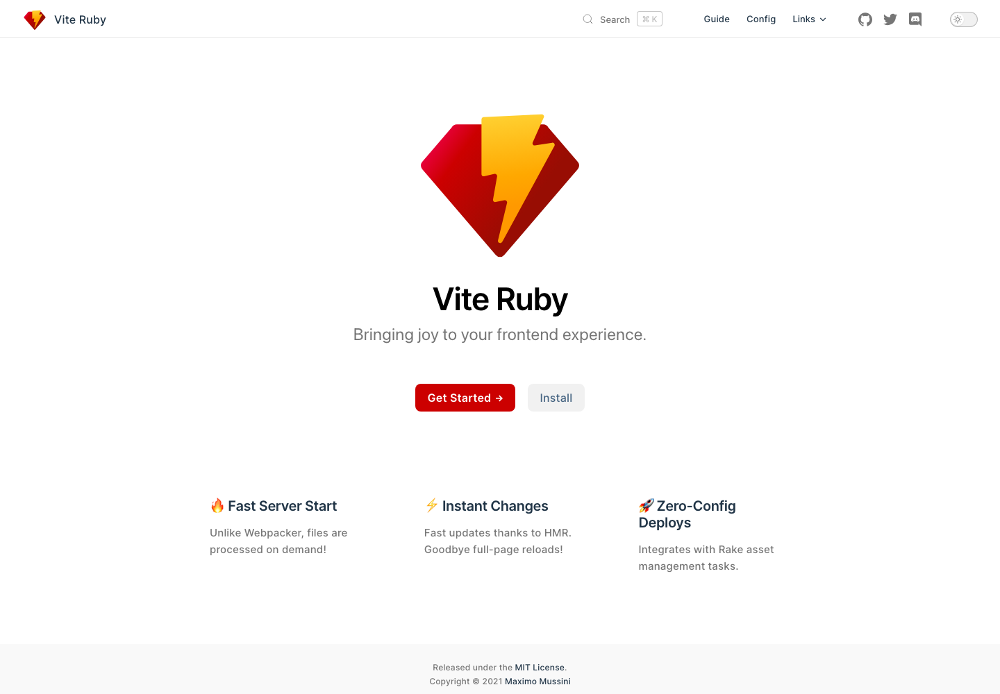
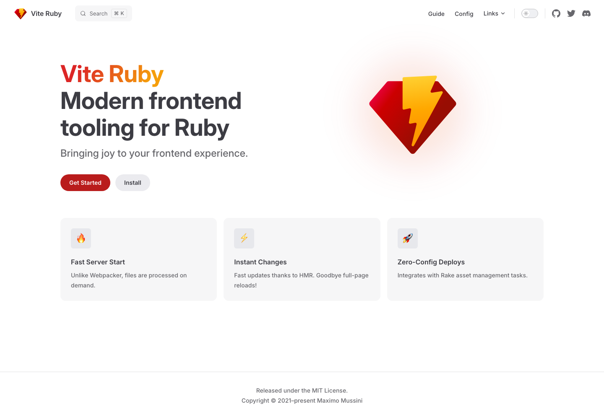
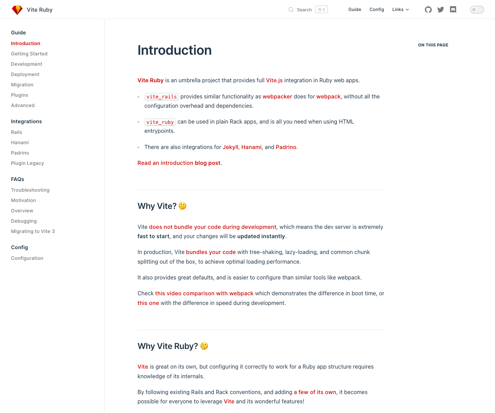
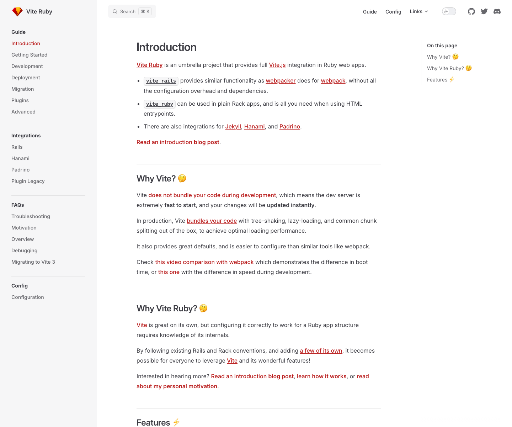

[Vite Ruby]: https://github.com/ElMassimo/vite_ruby

# VitePress Docs Theme

The shared [VitePress](https://vitepress.dev/) theme for the [Vite Ruby] documentation sites.

Version 2 extends the maintained VitePress default theme instead of copying its components. Sites automatically receive current code blocks, navigation, search, responsive behavior, accessibility, and future upstream fixes while retaining a small layer of shared styling.

## Before and after

| Page | VitePress 0.22 theme | Modernized VitePress 2 theme |
| --- | --- | --- |
| Home |  |  |
| Guide |  |  |

## Usage

```ts
// .vitepress/config.ts
import baseConfig from '@mussi/vitepress-theme/config'
import { defineConfig } from 'vitepress'

export default defineConfig({
  extends: baseConfig,
  themeConfig: {
    logo: '/logo.svg',
    search: {
      provider: 'algolia',
      options: {
        appId: '...',
        apiKey: '...',
        indexName: '...'
      }
    }
  }
})
```

```ts
// .vitepress/theme/index.ts
import { VPTheme } from '@mussi/vitepress-theme'

export default VPTheme
```

## Migrating from 1.x

Version 2 targets VitePress 2 and uses its default-theme configuration directly.

- Replace `themeConfig.algolia` with `themeConfig.search: { provider: 'algolia', options: { ... } }`.
- Use `layout: home` with VitePress's `hero` and `features` frontmatter instead of `page: true` and a custom home component.
- Replace `editLink.repo` with VitePress's `editLink.pattern`.
- Replace the custom footer `license` object with `footer.message`; `footer.copyright` remains available.
- Use `--vp-*` CSS variables and `.vp-doc` selectors instead of the removed `--vt-*` variables and `.vt-doc` class.
- Remove the `/highlight` import if used. VitePress now owns Shiki configuration through `markdown.theme`.

See the [VitePress default theme configuration](https://vitepress.dev/reference/default-theme-config) for the full API.
